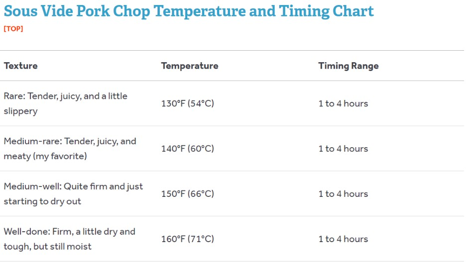

# Sous Vide Pork Chops

Author: J. Kenji Lopez Alt

[Recipe Link](https://www.seriouseats.com/recipes/2016/04/sous-vide-pork-chops-recipe.html)

## Ingredients 
- 4 bone-in pork rib chops, 1 1/2 inches thick each (about 2 1/2 pounds; 1.1kg total)
- Kosher salt and freshly ground black pepper
- 4 sprigs thyme or rosemary (optional)
- 2 garlic cloves (optional)
- 2 shallots, thinly sliced (optional)
- 2 tablespoons (30ml) vegetable, canola, or rice bran oil (optional)
- 2 tablespoons (30ml) butter (optional)

## Directions
1. Preheat a sous vide cooker to the desired final temperature according to the chart above. Season pork chops generously with salt and pepper. Place in sous vide bags along with herbs, garlic, and shallots (if using) and distribute evenly. Seal bags and place in water bath for time recommended in chart above.
2. *To Finish in a Pan:* Turn on your vents and open your windows. Remove pork from water bath and bag and carefully pat dry with paper towels. Add vegetable, canola, or rice bran oil to a heavy cast iron or stainless steel skillet, place it over the hottest burner you have, and preheat skillet until it starts to smoke. Working in batches if necessary, gently lay pork chops in skillet, using your fingers or a set of tongs. If desired, add 1 tablespoon butter; for a cleaner-tasting sear, omit butter at this stage. Carefully lift and peek under pork as it cooks to gauge how quickly it is browning. Let it continue to cook until the crust is deep brown and very crisp, about 45 seconds.
3. Flip pork chops. If desired, add 1 more tablespoon butter, along with thyme, rosemary, garlic, and/or shallots. Spoon butter over pork chops as they cook. Continue cooking until second side is browned, about 45 seconds longer.
4. When pork is browned, pick it up with a pair of tongs, rotate it sideways, and make sure to brown the edges as well. Transfer cooked pork chops to a wire rack set over a rimmed baking sheet and repeat with remaining pork chops as necessary.
5. Just before serving, reheat the drippings in the pan until sizzling-hot, then pour them over pork chops in order to re-crisp their exteriors. Serve immediately.
6. *To Finish on the Grill:* Light one chimney full of charcoal. When all the charcoal is lit and covered with gray ash, pour out and arrange the coals on one side of the charcoal grate. Set cooking grate in place, cover grill, and allow to preheat for 5 minutes. Alternatively, set half the burners on a gas grill to the highest heat setting, cover, and preheat for 10 minutes. Clean and oil the grilling grate. Remove pork chops from water bath and bag and carefully pat dry with paper towels. Place pork chops directly over the hot side of the grill and cook, turning every 15 to 30 seconds, until a deep, rich crust has formed, about 1 1/2 minutes total. If the fire threatens to flare up as pork chops drip fat into it, suffocate the fire by closing the grill lid until the flames die out. Alternatively, transfer pork chops to the cooler side of the grill using a set of long tongs until the flames subside. Do not allow pork chops to become engulfed in flames. Transfer cooked pork chops to a cutting board or serving platter and serve immediately.

